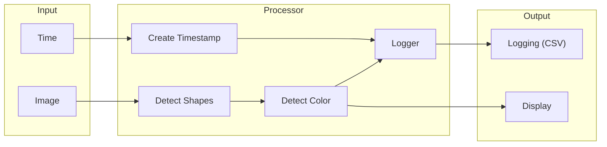
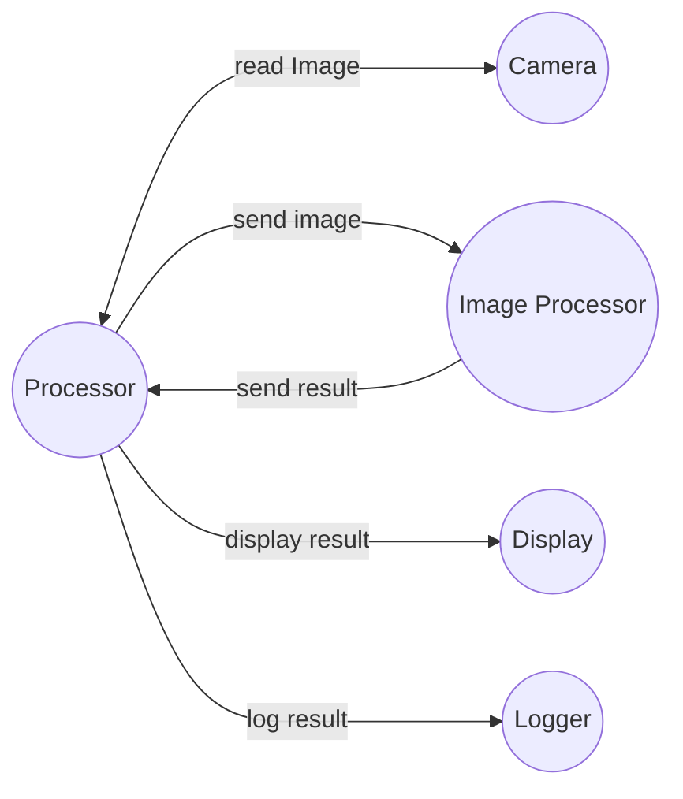
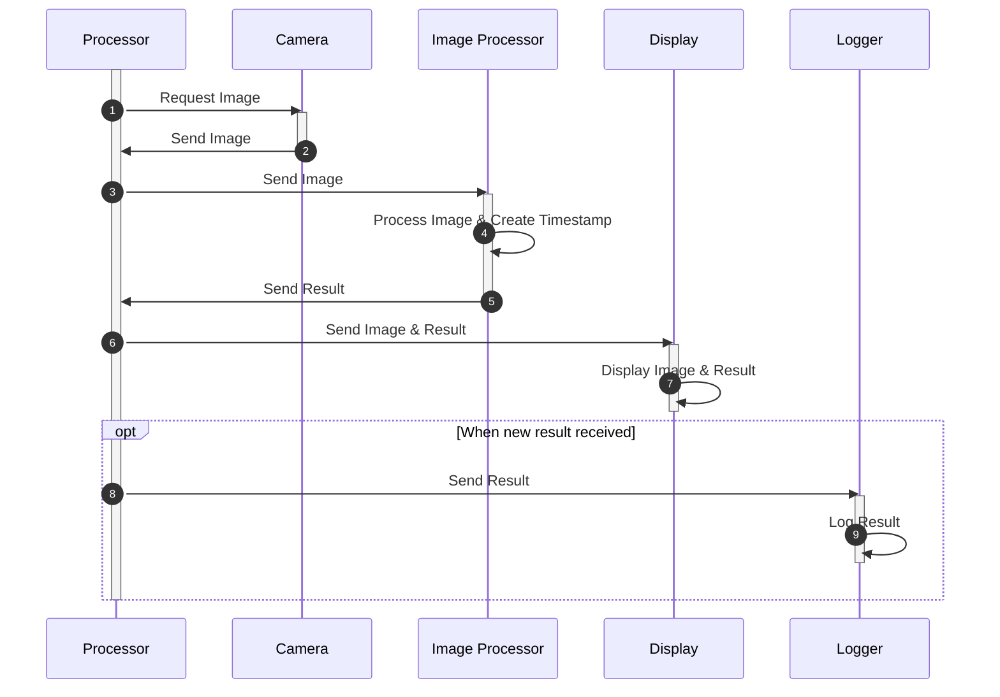
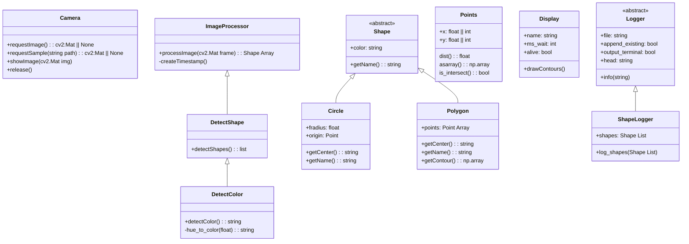

# Anforderungen
- Bild einlesen
- Fenster generieren und Bild anzeigen
- Erkennen von Formen: Rechteck, Quadrat, Dreieck, Kreis und Farben:  Rot, Grün, Gelb, Blau, Violett
- Formen umranden und beschriften
- Bild anzeigen
- Logging
  - Timestamp
  - Shape
  - Color
  - Ouptut as CSV

## Input-Processor-Output Diagram

## Component Diagram

## Sequence Diagram

## Classes
